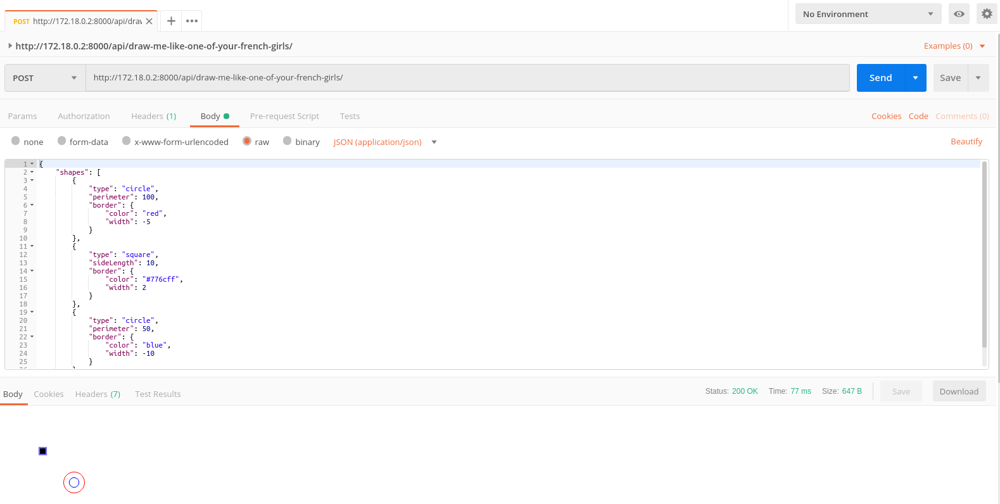

# netasvg

1. Build docker image
    ```bash
    docker-compose up
    ```

2.  Enter docker container with
    ```bash
    docker-compose exec php-fpm bash
    ```

3. Inside docker container run:
    ```bash
    composer install
    
    php bin/console -vvv server:run 0.0.0.0:8000
    ```
Install [Postman](https://www.getpostman.com/) and import [postman_request](./postman_neta_svg.json) to test the api.


